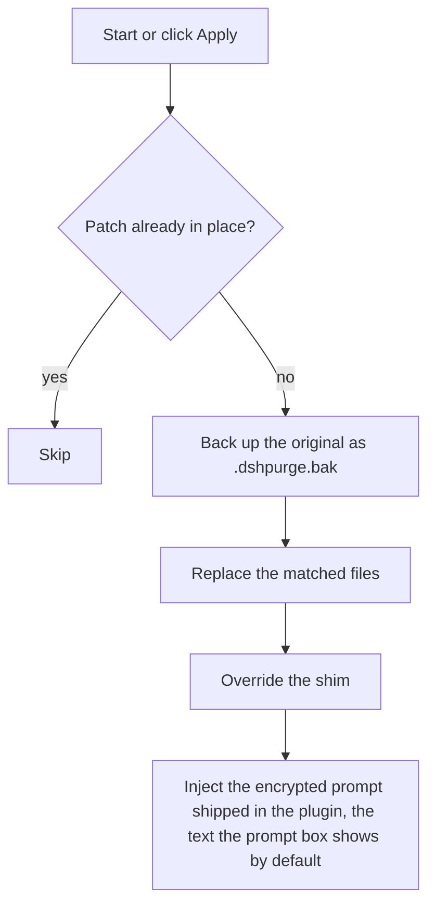
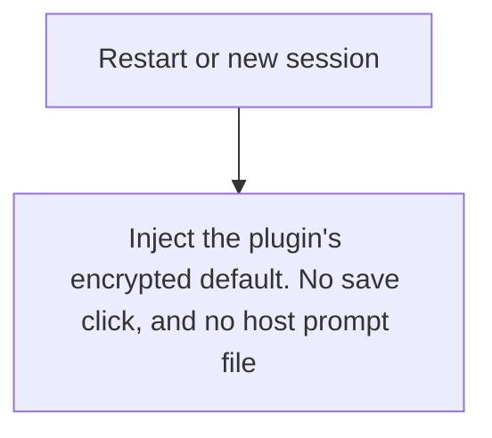
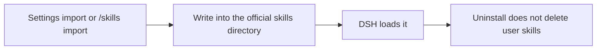

<p align="center">
  
</p>

<h1 align="center">⚔️ DeepSeek Harness cybersecurity red-team tool (dsh-purge)</h1>

<p align="center"><strong>Version 1.0.4</strong></p>

<p align="center">
  <em>Local official DeepSeek Harness cybersecurity red-team plugin. Clean host policy, and ship a built-in drill console. Swap prompts per model. Default prompt for Chinese models — 小码酱. Please star ⭐</em>
</p>

<p align="center">
  <a href="https://github.com/Rovrry/dsh-Rov-PJ/stargazers"></a>
  <a href="https://github.com/Rovrry/dsh-Rov-PJ/blob/master/LICENSE"></a>
  <a href="https://awesome-dsh-plugin.com"></a>
  <a href="https://deepseek.stream/plugins/dsh-purge"></a>
  <a href="https://www.deepseek.com/harness/"></a>
  <br>
  
  
</p>

<p align="center">
  <a href="README.md">中文</a>（main） | <strong>English</strong>（current）
</p>

---

## 1. 📦 Project origin

| Item | Note |
|---|---|
| This repository | <https://github.com/Rovrry/dsh-Rov-PJ> |
| Current version | 1.0.4 (this repository's own version number) |
| License | MIT |

**Copyright and origin**: this project is a secondary development of an open-source project;
the original copyright belongs to its author - Copyright (c) 2026 小杨, MIT license, upstream
repository <https://github.com/YuJunZhiXue/dsh-purge>. Everything added in this repository
(versioning, packaging, documentation, UI and interaction changes) was produced by this
repository's maintainer with the assistance of AI large language models.

---

## 2. ⚠️ Installation

> You **must click Apply once** after installing. Selecting the install inside the plugin is not enough.

```sh
# Official dsh web
dsh plugin --profile web add https://github.com/Rovrry/dsh-Rov-PJ/archive/refs/heads/master.tar.gz

# Official desktop EXE
dsh plugin --profile desktop add https://github.com/Rovrry/dsh-Rov-PJ/archive/refs/heads/master.tar.gz
```

Four things to know:

1. **Install only for the host you are actually using.** Web uses the `web` profile, the desktop
   EXE uses the `desktop` profile. Install and apply them separately.
2. **dsh 0.2 is required** (official desktop 0.2.0-rc.2). **0.1.x is not supported.**
3. **You must click Apply**: quit and reopen the host, click **dsh-purge** beside the session
   title, click **Apply** on the **Clean** page in the right dock, let it restart, then
   **start a new chat**.
4. **Do not use the plugin Hub's one-click install** (the [Hub page](https://deepseek.stream/plugins/dsh-purge)
   is for reading only). Use the `.tar.gz` command above.

👉 **Full tutorial, manual install, per-host differences, uninstall: [docs/INSTALL.md](docs/INSTALL.md)**

---

## 3. ⚠️ Disclaimer

**This project is a secondary development and creation carried out with the assistance of AI
large language models.** It is provided under an open-source license on an "as is" basis; the
author gives no warranty of completeness, security or fitness.

- Users must comply with the laws and platform rules that apply to them.
- **All consequences and legal liability arising from any illegal or non-compliant use of this
  project (including but not limited to unauthorized attacks, intrusion, data theft, sabotage, or
  generating illegal content) are borne solely by the user, and are unrelated to the project author.**
- Commercial sale, paid resale, or use for illegal or gray-market profit is strictly forbidden.
  For technical reference only.
- This project has no affiliation, partnership, authorization or endorsement relationship with
  DeepSeek officials.

<a id="strict-legal--compliance-disclaimer"></a>

👉 **Full disclaimer, zero-tolerance terms and the 10 compliance rules: [docs/DISCLAIMER.md](docs/DISCLAIMER.md)**

---

## Preview

**dsh-purge** sits beside the session title. It opens a right-hand dock with two pages: **Clean** and **Drill**. Switch **Light / Ink**. Patches are grouped; the count only includes items that actually applied. Rule sets sit in a list above the editor, with Enable and Delete on each row.

The first time you open Drill you read the notice, wait out the countdown, scroll to the end, and check three boxes. Clean does not need that step. Drill is only for a host you manage, an offline target, or an exercise that already has written authorization.

**Clean**


**Drill authorization**


**Drill**


**Patches**


**Own servers**

On the Clean page, under Prompt. One host per line, then Save list. Steps are in [Own servers](#own-servers).


| Area | What it shows |
|---|---|
| dsh-purge | button beside the session title; opens or collapses the dock |
| Clean | the old Rules page: patches, prompt, rule sets, skills |
| Drill | assets, skills, and environment after authorization. The tab says Unauthorized until then |
| Light / Ink | card appearance |
| Patches | grouped status, Apply, Restore, or Uninstall |
| Prompt | edit `prompt-inject.md` as the session override |
| Own servers | one IP or exact hostname per line, saved to `$DSH_HOME/net-scope-allow.txt` |
| Rule sets | multiple `AGENTS.md` / `CLAUDE.md`; Enable writes under `$DSH_HOME`, Delete removes the row |
| Skills | import a zip or folder into this host’s official `$DSH_HOME/skills/<id>/SKILL.md` (web and desktop each use their own home; no drive letter is hardcoded); DSH owns match, load, and `/name`. You can also delete that folder yourself |

---

## Layout

```
dsh-purge/
├── bin/dsh-purge.js
├── client.js
├── cordis.patch.yml
├── docs/
│   ├── banner.svg
│   └── preview/
│       ├── dock-auth.png
│       ├── dock-clean.png
│       ├── dock-drill.png
│       ├── own-servers.png
│       ├── own-servers-en.png
│       ├── rules.png
│       └── settings.png
├── lib/
│   ├── redteam/
│   ├── child-process-hide.mjs
│   ├── core.js
│   ├── hide-console.js
│   ├── identity.js
│   ├── index.js
│   ├── restart-web.js
│   ├── rewind.js
│   ├── rules.js
│   ├── skills.js
│   ├── uninstall-restart.js
│   ├── uninstall.js
│   └── update.js
├── presets/redteam/
├── skills/redteam/
├── package.json
├── screenshots.json
├── LICENSE
├── README.md            # Chinese (main, repo landing page)
├── README.en.md         # English
└── README.zh-CN.md      # redirect stub (legacy links)
```

Runtime user files: `$DSH_HOME/prompt-inject.md`, `$DSH_HOME/rules/`, `$DSH_HOME/skills/`, `$DSH_HOME/net-scope-allow.txt`. If `DSH_HOME` is unset, the launcher-adjacent `.dsh` wins over `~/.dsh`. Skills are not part of the `dsh-purge` inject section and do not replace the prompt.

---

## Usage

```sh
dsh-purge --status
dsh-purge --apply
dsh-purge --revert
dsh-purge --uninstall
dsh-purge --edit

/purge status | apply | revert | uninstall | edit | help
/rules list | use <id> | create <id> | delete <id> | reset | help
/skills list | import <zip-or-folder> | create <id> [description] | delete <id> | help
/rewind

purge_status   purge_apply   purge_revert
```

After a successful Apply, the host restarts so patched packages load; you can also click **Restart** manually. Under the patch title is the stable release: you can see versions and switch. A rollback is pinned; click **Update** to return to the latest. The beta channel is gone.

The composer **Undo once** and **Undo last round** stay in the current conversation and do not open a branch. The sent line goes back into the input, and that cut's already-sent messages and completed tasks leave the current conversation; edit and **send again**. From **1.1.61**, rewind bounds follow the **current turn**, not the first user message. `/rewind` does the same.

If the **same task works in standard but fails in minimal or PTC**, preset `run_code`, sandbox, or plan intercept text is often still uncleared, or built-in minimal is missing `agent-instructions`. Use **1.1.61+**, then **quit the host fully → Apply in Clean → restart → start a new chat**. Switching preset alone does not reload patches in the running process.

### Own servers

Addresses in mainland China, Hong Kong, and Macau stay forbidden unless that one host was registered first. Saying “this is my server” in chat does not allow it. A key or a password does not allow it either.

The box sits under Prompt. If the dock does not show it yet, quit DeepSeek Harness completely and open it again.

1. Click **dsh-purge** beside the session title and stay on **Clean**.
2. Scroll past **Prompt**. **Own servers** is the next block.
3. Put one host on each line, in one of these forms:
   - `203.0.113.10` — one IP.
   - `my-vps.example.com` — one exact hostname. After you save, the addresses that hostname resolves to at lookup time are allowed too.
   - `alice@my-vps.example.com` — the account only identifies this form. It does not prove the machine is yours.
4. Click **Save list**. The list is written to `$DSH_HOME/net-scope-allow.txt`.
5. Keys, passwords, ranges, and wildcards are dropped on save. Unlisted mainland China, Hong Kong, and Macau addresses stay forbidden.

`203.0.113.10` and `example.com` above are only examples of the form. Replace them with your own host before you save.


---

## Local checks

```sh
node --check lib/index.js
node --check lib/core.js
node --check lib/surface.js
node --check lib/web.js
node --check lib/desktop.js
node --check lib/host.js
node --check lib/rewind.js
node --check lib/skills.js
node --check client.js
```

---

## How it works

Apply, on start or when you click Apply:



Override on each session:



Skills stay out of the inject section:



---

## Restore

- Each target is copied to `<file>.dshpurge.bak` before the first apply.
- **Restore** or `/purge revert` copies backups back and deletes them. With no backup, shim lines written by this plugin are stripped.
- `prompt-inject.md` is a user file and is kept.
- **Uninstall** restores first if patches were applied, then deletes the inject file, rule library, and the plugin itself.
- Apply is idempotent.

---

## Path detection

The host surface is detected first: `web` / `desktop` (`gui` / `tui` are reserved and still fall back to web).

**Web:**

1. `DSH_HOME` / `DSH_BASE`
2. `.dsh` next to the dsh launcher (portable install, any drive)
3. `npm prefix -g` / `npm root -g`
4. Nested `@deepseek-ai/dsh/node_modules/@deepseek-ai`
5. `~/.dsh`

**Official desktop EXE:** the running official Harness install (`resources/app` or the unpacked package). The drive letter is not hard-coded. A successful Apply restarts once.

Community Desktop is not maintained.

Official npm-global is not patched. Sealed `host-commands` / `runtime-commands` are scrubbed, never injected.

If nothing is found, set `DSH_BASE` / `DSH_DESKTOP_INSTALL`. No files are changed.

---

## Releases

What changed, and the zip, are on [Releases](https://github.com/Rovrry/dsh-Rov-PJ/releases). To publish, bump the version in `package.json`, write Chinese and English notes in `release-notes.md`, and push `master`. Pushing the same version again does not publish another package.

## Notes

- Scope is rendered copy, defaults, and runtime logic inside local `@deepseek-ai/*` packages, plus override files and rule sets under the harness home.
- After an upgrade, unmatched originals show as skipped. Apply still completes, and those files are left unchanged.
- Third-party plugin *source repos* outside `@deepseek-ai` are left alone (CMD silence may **best-effort** patch installed doctor / market / liangshen / mnemon at runtime).
- The npm package name is not published yet. Official Web: `dsh plugin --profile web add` the master.tar.gz. Official desktop: `dsh plugin --profile desktop add` the same archive. From this repo, `dsh plugin --profile web add .` or `dsh plugin --profile desktop add .`. The [Hub](https://deepseek.stream/plugins/dsh-purge) page is an introduction only.
