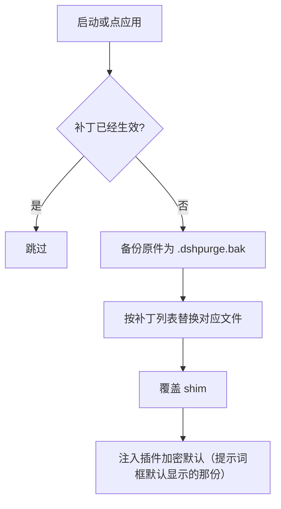
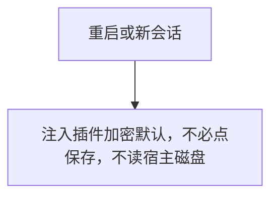
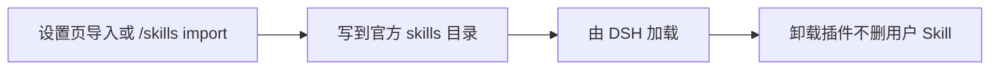

<p align="center">
  
</p>

<h1 align="center">⚔️ DeepSeek Harness 网络安全红队工具（dsh-purge）</h1>

<p align="center"><strong>Version 1.0.4</strong></p>

<p align="center">
  <em>本机官方 DeepSeek Harness 网络安全红队评测插件。清洗宿主策略，并带内嵌演练台。不同模型可换不同提示词。默认提示词面向国模「小码酱」。求 Star 收藏 ⭐</em>
</p>

<p align="center">
  <a href="https://github.com/Rovrry/dsh-Rov-PJ/stargazers"></a>
  <a href="https://github.com/Rovrry/dsh-Rov-PJ/blob/master/LICENSE"></a>
  <a href="https://awesome-dsh-plugin.com"></a>
  <a href="https://deepseek.stream/plugins/dsh-purge"></a>
  <a href="https://www.deepseek.com/harness/"></a>
  <br>
  
  
</p>

<p align="center">
  <strong>中文</strong>（当前） | <a href="README.en.md">English</a>
</p>

---

## 一、📦 项目来源

| 项目 | 说明 |
|---|---|
| 本仓库 | <https://github.com/Rovrry/dsh-Rov-PJ> |
| 当前版本 | 1.0.4（本仓库独立版本号） |
| 授权协议 | MIT |

**版权与来源**：本项目基于开源项目二次开发，原始版权归其作者所有 ——
Copyright (c) 2026 小杨，MIT 协议，上游仓库 <https://github.com/YuJunZhiXue/dsh-purge>。
本仓库全部新增内容（版本号、打包、文档、界面与交互改动）由本仓库维护者以 AI 大模型协助完成。

---

## 二、⚠️ 安装教程

> 装完**必须点一次「应用」**，只在插件里选了安装还不生效。

```sh
# 官方 dsh web
dsh plugin --profile web add https://github.com/Rovrry/dsh-Rov-PJ/archive/refs/heads/master.tar.gz

# 官方桌面 EXE
dsh plugin --profile desktop add https://github.com/Rovrry/dsh-Rov-PJ/archive/refs/heads/master.tar.gz
```

四条注意事项：

1. **只装你正在打开的那一个宿主。** Web 用 `web` profile，桌面 EXE 用 `desktop` profile，分开装、分开应用。
2. **必须是 dsh 0.2**（官方桌面 0.2.0-rc.2）。**0.1.x 不支持。**
3. **装完必须点「应用」**：退出并重开宿主 → 点会话标题旁的 **dsh-purge** → 右侧栏 **清洗** 页点 **「应用」** → 自动重启 → **新开一轮对话**。
4. **不要用插件市场的一键安装**（[市场页](https://deepseek.stream/plugins/dsh-purge)只看介绍），用上面的 `.tar.gz` 命令。

👉 **完整安装教程、手动安装、各宿主差异、卸载方法：[docs/INSTALL.md](docs/INSTALL.md)**

---

## 三、⚠️ 免责声明

**本项目系由 AI 人工智能大模型协助进行的二次开发与创作成果**，按开源协议「按现状」提供，
作者不对其完整性、安全性、适用性作任何保证。

- 使用者须自行遵守所在地法律法规及平台规范。
- **任何因使用者违法违规使用本项目（包括但不限于未授权攻击、入侵、数据窃取、破坏系统或生成违法违禁内容）而产生的全部后果与法律责任，均由使用者本人独立承担，与项目作者无关。**
- 严禁任何主体用于商业售卖、付费倒卖或黑灰产牟利，仅供技术参考。
- 本项目与 DeepSeek 官方无任何隶属、合作、授权或背书关系。

<a id="strict-legal--compliance-disclaimer"></a>

👉 **完整免责声明、零容忍条款与 10 条合规细则：[docs/DISCLAIMER.md](docs/DISCLAIMER.md)**

---

## 界面预览

会话标题旁有 **dsh-purge**。点开是右侧栏，两页：**清洗** 和 **演练台**。白 / 墨可切换。补丁按组展开，进度只计真正已应用的项。规则集在上方列表启用或删除，下方编辑正文。

第一次进演练台要先读声明、等倒计时、滚到文末并勾选三项。清洗不需要这一步。演练台只用于你有权管理的本机、离线靶标，或已经书面授权的演练环境。

**清洗**


**演练台授权**


**演练台**


**补丁**


**规则集**


**自己的服务器**

在清洗页，提示词下面。每行一台，点保存名单。步骤见 [自己的服务器](#自己的服务器)。


| 区域 | 说明 |
|---|---|
| dsh-purge | 会话标题旁的按钮，打开或收起右侧栏 |
| 清洗 | 原来的规则设定：补丁、提示词、规则集、Skill |
| 演练台 | 授权后的资产、技能与环境页。未授权时按钮标「未授权」 |
| 白 / 墨 | 设置卡片外观 |
| 补丁 | 分组查看状态，应用、还原或卸载 |
| 提示词 | 编辑 `prompt-inject.md`，作为会话覆盖段 |
| 自己的服务器 | 每行登记一个 IP 或完整主机名，保存后写入 `$DSH_HOME/net-scope-allow.txt` |
| 规则集 | 多套 `AGENTS.md` / `CLAUDE.md`；启用写入 `$DSH_HOME`，删除从列表去掉 |
| Skill | 导入压缩包或文件夹到当前宿主官方目录 `$DSH_HOME/skills/<id>/SKILL.md`（Web / 桌面各用自己的主目录，不写死盘符）；命中、加载、`/名称` 由 DSH 负责。也可自己删该文件夹 |

---

## 目录结构

```
dsh-purge/
├── bin/dsh-purge.js
├── client.js
├── cordis.patch.yml
├── docs/
│   ├── banner.svg
│   └── preview/
│       ├── dock-auth.png
│       ├── dock-clean.png
│       ├── dock-drill.png
│       ├── own-servers.png
│       ├── own-servers-en.png
│       ├── rules.png
│       └── settings.png
├── lib/
│   ├── redteam/
│   ├── child-process-hide.mjs
│   ├── core.js
│   ├── hide-console.js
│   ├── identity.js
│   ├── index.js
│   ├── restart-web.js
│   ├── rewind.js
│   ├── rules.js
│   ├── skills.js
│   ├── uninstall-restart.js
│   ├── uninstall.js
│   └── update.js
├── presets/redteam/
├── skills/redteam/
├── package.json
├── screenshots.json
├── LICENSE
├── README.md            # 中文（主，仓库首页）
├── README.en.md         # English
└── README.zh-CN.md      # 跳转页（旧链接兼容）
```

运行时用户文件：`$DSH_HOME/prompt-inject.md`、`$DSH_HOME/rules/`、`$DSH_HOME/skills/`、`$DSH_HOME/net-scope-allow.txt`。未设 `DSH_HOME` 时，优先用 dsh 安装目录旁边的 `.dsh`，再退回 `~/.dsh`。Skill 不进 `dsh-purge` 注入段，也不顶替提示词。

---

## 使用

```sh
# CLI
dsh-purge --status
dsh-purge --apply
dsh-purge --revert
dsh-purge --uninstall
dsh-purge --edit

# 聊天
/purge status | apply | revert | uninstall | edit | help
/rules list | use <id> | create <id> | delete <id> | reset | help
/skills list | import <压缩包或文件夹> | create <id> [说明] | delete <id> | help
/rewind

# 模型工具
purge_status   purge_apply   purge_revert
```

设置页「应用」成功后会自动重启，以加载已改的包文件；也可手动点「重启」。补丁标题下是正式版：可以看版本和切换。回退后会固定在该版本，要回到最新再点「更新」。测试版通道已去掉。

输入框旁的「回退一次」和「回退上一轮」都留在当前这条对话里，不另开分支。已发送的那句会回到输入框，这一轮已经发出的内容和已完成的任务会从当前对话撤掉，改字后**重新发送**即可。从 **1.1.61** 起，多轮对话后回退按**当前这一轮**定位，不会又退到第一条用户消息。聊天里 `/rewind` 同样可用。

**极简 / PTC 与标准不一致时**：同一任务在标准模式能跑、在极简或 PTC 被拦，通常是 preset 里 `run_code` 或 plan 拦截句没洗净，或内置 minimal 缺少 `agent-instructions`。请升到 **1.1.61+**，**完全退出宿主 → 清洗里应用 → 自动重启 → 新开一轮对话** 再试；只换 preset 不重应用，旧进程里的补丁不会更新。

### 自己的服务器

中国大陆、香港、澳门的地址默认禁止。只有事先登记的那一台可以例外。在对话里说「这是我的服务器」不会放行。密钥和密码也不会。

这一栏在提示词下面。若侧栏里还没有它，先完全退出 DeepSeek Harness，再重新打开。

1. 点会话标题旁的 **dsh-purge**，停在 **清洗**。
2. 往下滚过 **提示词**，下面就是 **自己的服务器**。
3. 每行只写一台，用下面三种写法之一：
   - `203.0.113.10`：一个 IP。
   - `my-vps.example.com`：一个完整主机名。保存后，这个主机名当时解析出来的地址也会放行。
   - `alice@my-vps.example.com`：账号只用来认出这种写法，不能证明这台机器属于你。
4. 点 **保存名单**。名单写在 `$DSH_HOME/net-scope-allow.txt`。
5. 密钥、密码、网段和通配符会在保存时丢掉。没有写进名单的大陆、香港、澳门地址仍然禁止。

上面的 `203.0.113.10` 和 `example.com` 只是写法示例，不是放行地址。把它们换成你自己的那一台再保存。


---

## 本地校验

```sh
node --check lib/index.js
node --check lib/core.js
node --check lib/rewind.js
node --check lib/skills.js
node --check client.js
```

---

## 工作原理

应用，启动时或手动点「应用」：



每次会话的覆盖：



Skill 不进注入段：



---

## 还原

- 每个目标文件在应用前备份为 `<文件>.dshpurge.bak`。
- 「还原」或 `/purge revert` 用备份覆盖回去并删除备份；没有备份时去掉 shim 里由本插件写入的行。
- `prompt-inject.md` 是用户文件，还原时保留。
- 「卸载」会先还原（若已应用），再删除注入文件、规则库和插件本身。
- 重复应用是幂等的。

---

## 路径探测

宿主面先判断 `web` / `desktop`（预留 `gui` / `tui`，尚未单独适配时回退 web）。

**Web：**

1. `DSH_HOME` / `DSH_BASE`
2. dsh 启动器旁的 `.dsh`
3. `npm prefix -g` / `npm root -g`
4. 嵌套 `@deepseek-ai/dsh/node_modules/@deepseek-ai`
5. 系统默认 `~/.dsh`

**官方桌面：** 只改当前正在运行的官方桌面安装。点「应用」成功后会自动重启一次。社区桌面端不维护。

找不到目标时提示设置 `DSH_BASE`，不改文件。

---

## 更新

每一版改了什么、安装包在 [Releases](https://github.com/Rovrry/dsh-Rov-PJ/releases)。发新版时把 `package.json` 的版本号改掉，中英文说明写进 `release-notes.md`，推到 `master` 就会自动打包。同一版本再推送不会重复发包。

## 说明

- 改动范围是本机 `@deepseek-ai/*` 包里的渲染文案、默认策略和执行逻辑，以及用户目录下的覆盖文件与规则集。
- 升级后原文对不上会显示跳过，这次应用仍算完成，不会乱改。
- 不改动非 `@deepseek-ai` 的第三方插件源仓库（启动时的 CMD 无感会**尽力**修补已装的 doctor / market / 梁神 / mnemon，属运行时补丁）。
- npm 上暂未发布同名包。官方 Web 用 `dsh plugin --profile web add` 加 master.tar.gz；官方桌面用 `dsh plugin --profile desktop add` 加同一个包。当前目录已是本仓库时，可以 `dsh plugin --profile web add .` 或 `dsh plugin --profile desktop add .`。[插件市场](https://deepseek.stream/plugins/dsh-purge)只看介绍。
