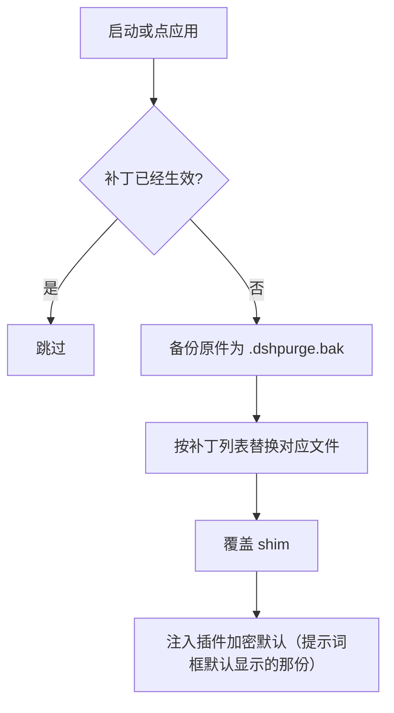
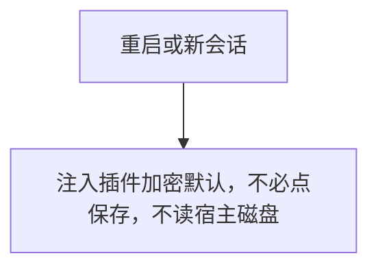
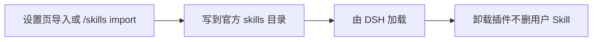
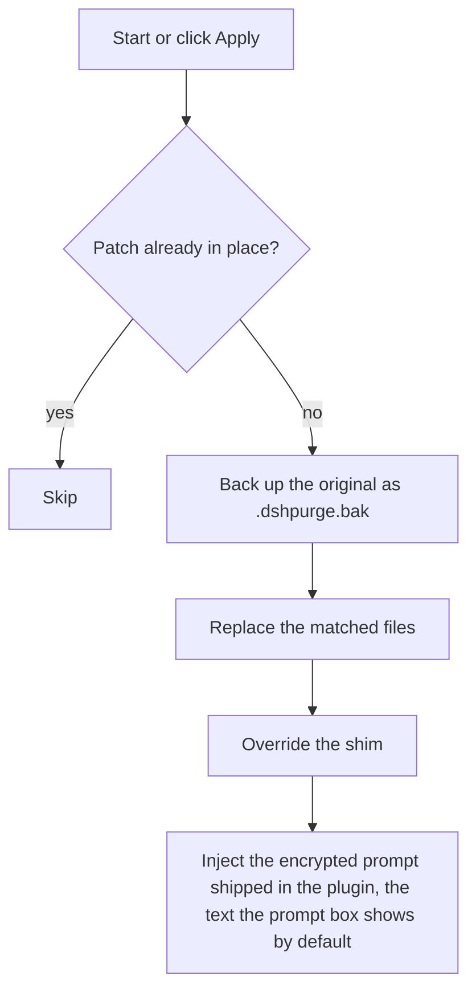
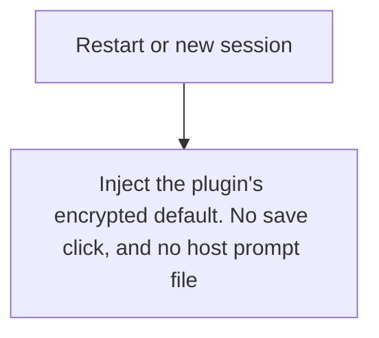
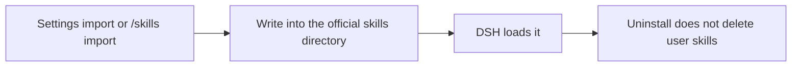

# 技术参考

> [README](../README.md) 的技术参考章节：目录结构、命令、工作原理、还原、路径探测等。

[← 返回仓库首页](../README.md) | [安装教程](INSTALL.md) | [界面与使用](USAGE.md) | [技术参考](REFERENCE.md) | [免责声明](DISCLAIMER.md)

---

## 目录结构

```
dsh-purge/
├── bin/dsh-purge.js
├── client.js
├── cordis.patch.yml
├── docs/
│   ├── banner.svg
│   └── preview/
│       ├── dock-auth.png
│       ├── dock-clean.png
│       ├── dock-drill.png
│       ├── own-servers.png
│       ├── own-servers-en.png
│       ├── rules.png
│       └── settings.png
├── lib/
│   ├── redteam/
│   ├── child-process-hide.mjs
│   ├── core.js
│   ├── hide-console.js
│   ├── identity.js
│   ├── index.js
│   ├── restart-web.js
│   ├── rewind.js
│   ├── rules.js
│   ├── skills.js
│   ├── uninstall-restart.js
│   ├── uninstall.js
│   └── update.js
├── presets/redteam/
├── skills/redteam/
├── package.json
├── screenshots.json
├── LICENSE
├── README.md            # 中文（主，仓库首页）
├── README.en.md         # English
└── README.zh-CN.md      # 跳转页（旧链接兼容）
```

运行时用户文件：`$DSH_HOME/prompt-inject.md`、`$DSH_HOME/rules/`、`$DSH_HOME/skills/`、`$DSH_HOME/net-scope-allow.txt`。未设 `DSH_HOME` 时，优先用 dsh 安装目录旁边的 `.dsh`，再退回 `~/.dsh`。Skill 不进 `dsh-purge` 注入段，也不顶替提示词。

---

## 本地校验

```sh
node --check lib/index.js
node --check lib/core.js
node --check lib/rewind.js
node --check lib/skills.js
node --check client.js
```

---

## 工作原理

应用，启动时或手动点「应用」：



每次会话的覆盖：



Skill 不进注入段：



---

## 还原

- 每个目标文件在应用前备份为 `<文件>.dshpurge.bak`。
- 「还原」或 `/purge revert` 用备份覆盖回去并删除备份；没有备份时去掉 shim 里由本插件写入的行。
- `prompt-inject.md` 是用户文件，还原时保留。
- 「卸载」会先还原（若已应用），再删除注入文件、规则库和插件本身。
- 重复应用是幂等的。

---

## 路径探测

宿主面先判断 `web` / `desktop`（预留 `gui` / `tui`，尚未单独适配时回退 web）。

**Web：**

1. `DSH_HOME` / `DSH_BASE`
2. dsh 启动器旁的 `.dsh`
3. `npm prefix -g` / `npm root -g`
4. 嵌套 `@deepseek-ai/dsh/node_modules/@deepseek-ai`
5. 系统默认 `~/.dsh`

**官方桌面：** 只改当前正在运行的官方桌面安装。点「应用」成功后会自动重启一次。社区桌面端不维护。

找不到目标时提示设置 `DSH_BASE`，不改文件。

---

## 版本与更新

每一版改了什么、安装包在 [Releases](https://github.com/Rovrry/dsh-Rov-PJ/releases)。发新版时把 `package.json` 的版本号改掉，中英文说明写进 `release-notes.md`，推到 `master` 就会自动打包。同一版本再推送不会重复发包。

## 说明

- 改动范围是本机 `@deepseek-ai/*` 包里的渲染文案、默认策略和执行逻辑，以及用户目录下的覆盖文件与规则集。
- 升级后原文对不上会显示跳过，这次应用仍算完成，不会乱改。
- 不改动非 `@deepseek-ai` 的第三方插件源仓库（启动时的 CMD 无感会**尽力**修补已装的 doctor / market / 梁神 / mnemon，属运行时补丁）。
- npm 上暂未发布同名包。官方 Web 用 `dsh plugin --profile web add` 加 master.tar.gz；官方桌面用 `dsh plugin --profile desktop add` 加同一个包。当前目录已是本仓库时，可以 `dsh plugin --profile web add .` 或 `dsh plugin --profile desktop add .`。[插件市场](https://deepseek.stream/plugins/dsh-purge)只看介绍。

---

[← 返回仓库首页](../README.md) | [安装教程](INSTALL.md) | [界面与使用](USAGE.md) | [技术参考](REFERENCE.md) | [免责声明](DISCLAIMER.md)

---
---

<a id="english"></a>

# English

> The English version of the technical reference chapters.

[← Back to repository home](../README.en.md) | [Installation](INSTALL.md#english) | [Interface and usage](USAGE.md#english) | [Disclaimer](DISCLAIMER.md#english)

---

## Layout

```
dsh-purge/
├── bin/dsh-purge.js
├── client.js
├── cordis.patch.yml
├── docs/
│   ├── banner.svg
│   └── preview/
│       ├── dock-auth.png
│       ├── dock-clean.png
│       ├── dock-drill.png
│       ├── own-servers.png
│       ├── own-servers-en.png
│       ├── rules.png
│       └── settings.png
├── lib/
│   ├── redteam/
│   ├── child-process-hide.mjs
│   ├── core.js
│   ├── hide-console.js
│   ├── identity.js
│   ├── index.js
│   ├── restart-web.js
│   ├── rewind.js
│   ├── rules.js
│   ├── skills.js
│   ├── uninstall-restart.js
│   ├── uninstall.js
│   └── update.js
├── presets/redteam/
├── skills/redteam/
├── package.json
├── screenshots.json
├── LICENSE
├── README.md            # Chinese (main, repo landing page)
├── README.en.md         # English
└── README.zh-CN.md      # redirect stub (legacy links)
```

Runtime user files: `$DSH_HOME/prompt-inject.md`, `$DSH_HOME/rules/`, `$DSH_HOME/skills/`, `$DSH_HOME/net-scope-allow.txt`. If `DSH_HOME` is unset, the launcher-adjacent `.dsh` wins over `~/.dsh`. Skills are not part of the `dsh-purge` inject section and do not replace the prompt.

---

## Local checks

```sh
node --check lib/index.js
node --check lib/core.js
node --check lib/surface.js
node --check lib/web.js
node --check lib/desktop.js
node --check lib/host.js
node --check lib/rewind.js
node --check lib/skills.js
node --check client.js
```

---

## How it works

Apply, on start or when you click Apply:



Override on each session:



Skills stay out of the inject section:



---

## Restore

- Each target is copied to `<file>.dshpurge.bak` before the first apply.
- **Restore** or `/purge revert` copies backups back and deletes them. With no backup, shim lines written by this plugin are stripped.
- `prompt-inject.md` is a user file and is kept.
- **Uninstall** restores first if patches were applied, then deletes the inject file, rule library, and the plugin itself.
- Apply is idempotent.

---

## Path detection

The host surface is detected first: `web` / `desktop` (`gui` / `tui` are reserved and still fall back to web).

**Web:**

1. `DSH_HOME` / `DSH_BASE`
2. `.dsh` next to the dsh launcher (portable install, any drive)
3. `npm prefix -g` / `npm root -g`
4. Nested `@deepseek-ai/dsh/node_modules/@deepseek-ai`
5. `~/.dsh`

**Official desktop EXE:** the running official Harness install (`resources/app` or the unpacked package). The drive letter is not hard-coded. A successful Apply restarts once.

Community Desktop is not maintained.

Official npm-global is not patched. Sealed `host-commands` / `runtime-commands` are scrubbed, never injected.

If nothing is found, set `DSH_BASE` / `DSH_DESKTOP_INSTALL`. No files are changed.

---

## Releases

What changed, and the zip, are on [Releases](https://github.com/Rovrry/dsh-Rov-PJ/releases). To publish, bump the version in `package.json`, write Chinese and English notes in `release-notes.md`, and push `master`. Pushing the same version again does not publish another package.

## Notes

- Scope is rendered copy, defaults, and runtime logic inside local `@deepseek-ai/*` packages, plus override files and rule sets under the harness home.
- After an upgrade, unmatched originals show as skipped. Apply still completes, and those files are left unchanged.
- Third-party plugin *source repos* outside `@deepseek-ai` are left alone (CMD silence may **best-effort** patch installed doctor / market / liangshen / mnemon at runtime).
- The npm package name is not published yet. Official Web: `dsh plugin --profile web add` the master.tar.gz. Official desktop: `dsh plugin --profile desktop add` the same archive. From this repo, `dsh plugin --profile web add .` or `dsh plugin --profile desktop add .`. The [Hub](https://deepseek.stream/plugins/dsh-purge) page is an introduction only.

---

[← Back to repository home](../README.en.md)
