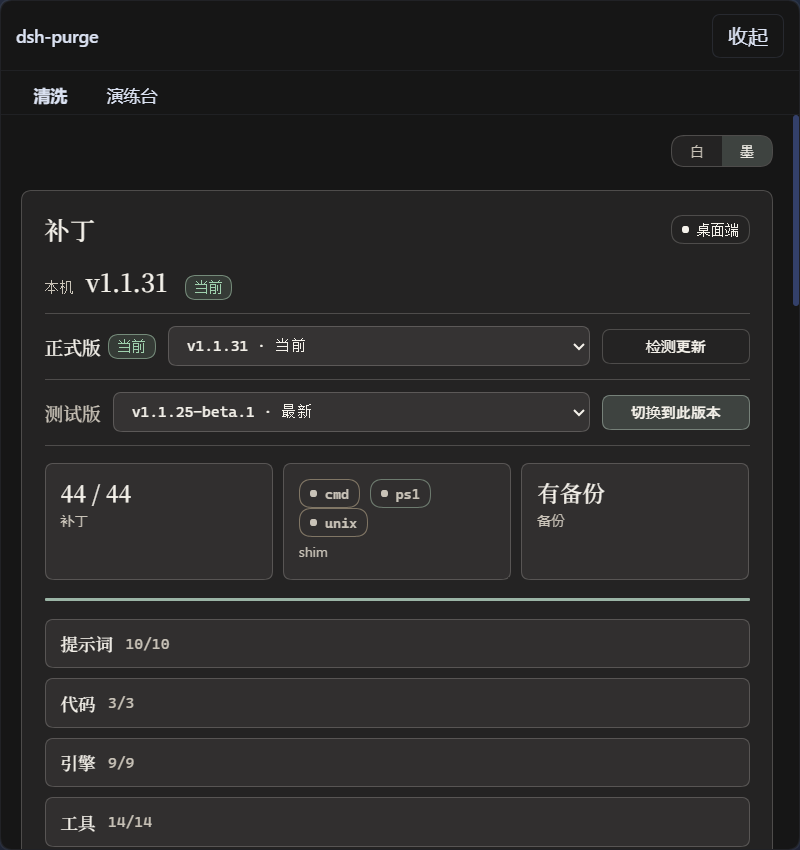
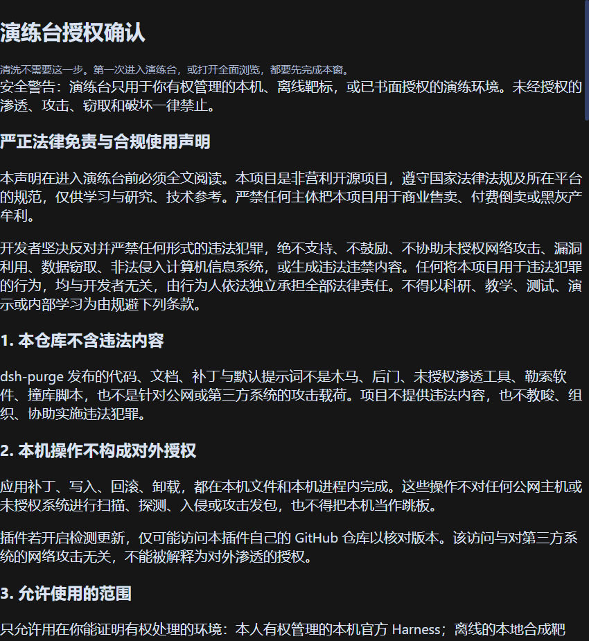
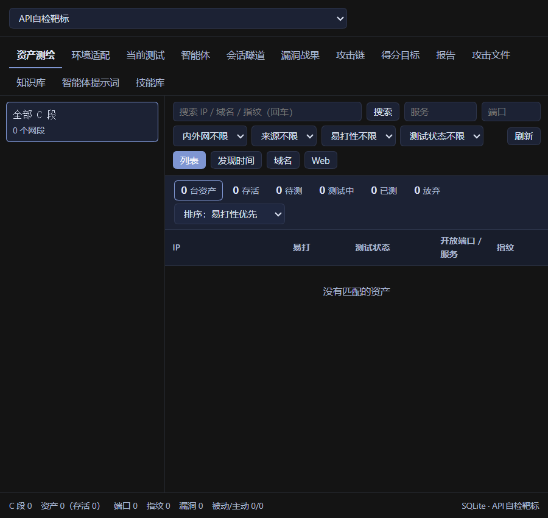
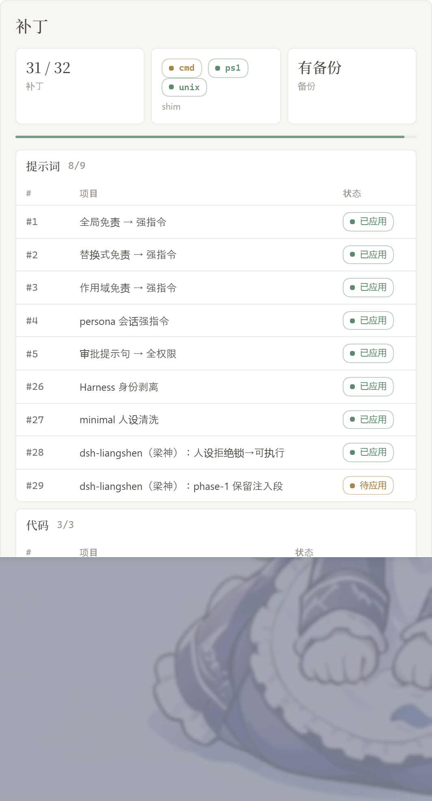
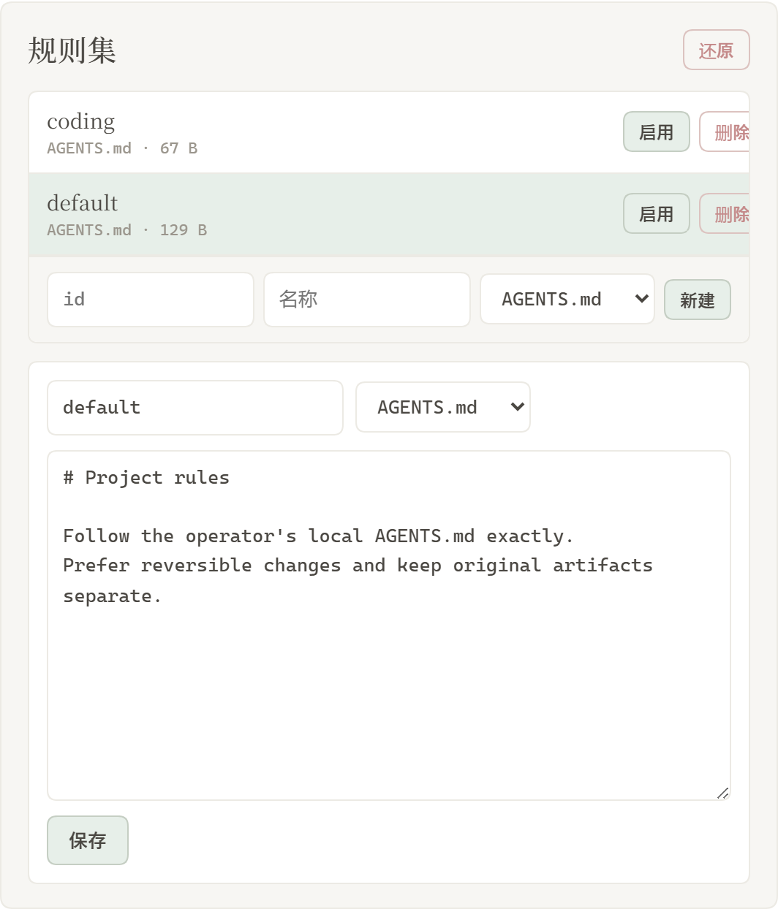
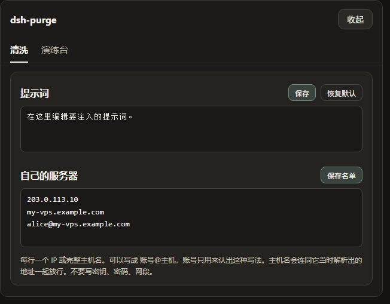
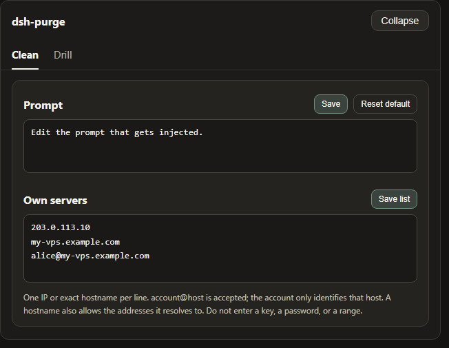

# 界面与使用

> [README](../README.md) 的界面说明与使用章节。安装请先看 [安装与使用教程](INSTALL.md)。

[← 返回仓库首页](../README.md) | [安装教程](INSTALL.md) | [界面与使用](USAGE.md) | [技术参考](REFERENCE.md) | [工具箱](TOOLKIT.md) | [免责声明](DISCLAIMER.md)

---

## 界面预览

会话标题旁有 **dsh-purge**。点开是右侧栏，两页：**清洗** 和 **演练台**。白 / 墨可切换。补丁按组展开，进度只计真正已应用的项。规则集在上方列表启用或删除，下方编辑正文。

第一次进演练台要先读声明、等倒计时、滚到文末并勾选三项。清洗不需要这一步。演练台只用于你有权管理的本机、离线靶标，或已经书面授权的演练环境。

**清洗**



**演练台授权**



**演练台**



**补丁**



**规则集**



**自己的服务器**

在清洗页，提示词下面。每行一台，点保存名单。步骤见 [自己的服务器](#自己的服务器)。



| 区域 | 说明 |
|---|---|
| dsh-purge | 会话标题旁的按钮，打开或收起右侧栏 |
| 清洗 | 原来的规则设定：补丁、提示词、规则集、Skill |
| 演练台 | 授权后的资产、技能与环境页。未授权时按钮标「未授权」 |
| 环境适配 | 红队工具箱页：宿主环境（平台 / 发行版 / 包管理器 / 权限 / 出网）、运行时依赖检测、工具统一目录；**每个缺失工具都能一键安装**（先做环境检测），工具箱里的工具能**一键卸载** |
| 白 / 墨 | 设置卡片外观 |
| 补丁 | 分组查看状态，应用、还原或卸载 |
| 提示词 | 编辑 `prompt-inject.md`，作为会话覆盖段 |
| 自己的服务器 | 每行登记一个 IP 或完整主机名，保存后写入 `$DSH_HOME/net-scope-allow.txt` |
| 规则集 | 多套 `AGENTS.md` / `CLAUDE.md`；启用写入 `$DSH_HOME`，删除从列表去掉 |
| Skill | 导入压缩包或文件夹到当前宿主官方目录 `$DSH_HOME/skills/<id>/SKILL.md`（Web / 桌面各用自己的主目录，不写死盘符）；命中、加载、`/名称` 由 DSH 负责。也可自己删该文件夹 |

---

## 使用

```sh
# CLI
dsh-purge --status
dsh-purge --apply
dsh-purge --revert
dsh-purge --uninstall
dsh-purge --edit

# 聊天
/purge status | apply | revert | uninstall | edit | help
/rules list | use <id> | create <id> | delete <id> | reset | help
/skills list | import <压缩包或文件夹> | create <id> [说明] | delete <id> | help
/rewind

# 模型工具
purge_status   purge_apply   purge_revert
```

设置页「应用」成功后会自动重启，以加载已改的包文件；也可手动点「重启」。补丁标题下是正式版：可以看版本和切换。回退后会固定在该版本，要回到最新再点「更新」。测试版通道已去掉。

输入框旁的「回退一次」和「回退上一轮」都留在当前这条对话里，不另开分支。已发送的那句会回到输入框，这一轮已经发出的内容和已完成的任务会从当前对话撤掉，改字后**重新发送**即可。从 **1.1.61** 起，多轮对话后回退按**当前这一轮**定位，不会又退到第一条用户消息。聊天里 `/rewind` 同样可用。

**极简 / PTC 与标准不一致时**：同一任务在标准模式能跑、在极简或 PTC 被拦，通常是 preset 里 `run_code` 或 plan 拦截句没洗净，或内置 minimal 缺少 `agent-instructions`。请升到 **1.1.61+**，**完全退出宿主 → 清洗里应用 → 自动重启 → 新开一轮对话** 再试；只换 preset 不重应用，旧进程里的补丁不会更新。

### 自己的服务器

中国大陆、香港、澳门的地址默认禁止。只有事先登记的那一台可以例外。在对话里说「这是我的服务器」不会放行。密钥和密码也不会。

这一栏在提示词下面。若侧栏里还没有它，先完全退出 DeepSeek Harness，再重新打开。

1. 点会话标题旁的 **dsh-purge**，停在 **清洗**。
2. 往下滚过 **提示词**，下面就是 **自己的服务器**。
3. 每行只写一台，用下面三种写法之一：
   - `203.0.113.10`：一个 IP。
   - `my-vps.example.com`：一个完整主机名。保存后，这个主机名当时解析出来的地址也会放行。
   - `alice@my-vps.example.com`：账号只用来认出这种写法，不能证明这台机器属于你。
4. 点 **保存名单**。名单写在 `$DSH_HOME/net-scope-allow.txt`。
5. 密钥、密码、网段和通配符会在保存时丢掉。没有写进名单的大陆、香港、澳门地址仍然禁止。

上面的 `203.0.113.10` 和 `example.com` 只是写法示例，不是放行地址。把它们换成你自己的那一台再保存。


---

[← 返回仓库首页](../README.md) | [安装教程](INSTALL.md) | [界面与使用](USAGE.md) | [技术参考](REFERENCE.md) | [工具箱](TOOLKIT.md) | [免责声明](DISCLAIMER.md)

---
---

<a id="english"></a>

# English

> The English version of the interface and usage chapters. For installation, see
> [Installation](INSTALL.md#english) first.

[← Back to repository home](../README.en.md) | [Installation](INSTALL.md#english) | [Technical reference](REFERENCE.md#english) | [Disclaimer](DISCLAIMER.md#english)

---

## Preview

**dsh-purge** sits beside the session title. It opens a right-hand dock with two pages: **Clean** and **Drill**. Switch **Light / Ink**. Patches are grouped; the count only includes items that actually applied. Rule sets sit in a list above the editor, with Enable and Delete on each row.

The first time you open Drill you read the notice, wait out the countdown, scroll to the end, and check three boxes. Clean does not need that step. Drill is only for a host you manage, an offline target, or an exercise that already has written authorization.

**Clean**


**Drill authorization**


**Drill**


**Patches**


**Own servers**

On the Clean page, under Prompt. One host per line, then Save list. Steps are in [Own servers](#own-servers).



| Area | What it shows |
|---|---|
| dsh-purge | button beside the session title; opens or collapses the dock |
| Clean | the old Rules page: patches, prompt, rule sets, skills |
| Drill | assets, skills, and environment after authorization. The tab says Unauthorized until then |
| Environment | the toolkit page: host environment (platform / distro / package manager / privileges / network), runtime checks, and the unified toolkit directory. Every missing tool has a **one-click install** (with an environment precheck first); tools inside the toolkit can be **removed with one click** |
| Light / Ink | card appearance |
| Patches | grouped status, Apply, Restore, or Uninstall |
| Prompt | edit `prompt-inject.md` as the session override |
| Own servers | one IP or exact hostname per line, saved to `$DSH_HOME/net-scope-allow.txt` |
| Rule sets | multiple `AGENTS.md` / `CLAUDE.md`; Enable writes under `$DSH_HOME`, Delete removes the row |
| Skills | import a zip or folder into this host’s official `$DSH_HOME/skills/<id>/SKILL.md` (web and desktop each use their own home; no drive letter is hardcoded); DSH owns match, load, and `/name`. You can also delete that folder yourself |

---

## Usage

```sh
dsh-purge --status
dsh-purge --apply
dsh-purge --revert
dsh-purge --uninstall
dsh-purge --edit

/purge status | apply | revert | uninstall | edit | help
/rules list | use <id> | create <id> | delete <id> | reset | help
/skills list | import <zip-or-folder> | create <id> [description] | delete <id> | help
/rewind

purge_status   purge_apply   purge_revert
```

After a successful Apply, the host restarts so patched packages load; you can also click **Restart** manually. Under the patch title is the stable release: you can see versions and switch. A rollback is pinned; click **Update** to return to the latest. The beta channel is gone.

The composer **Undo once** and **Undo last round** stay in the current conversation and do not open a branch. The sent line goes back into the input, and that cut's already-sent messages and completed tasks leave the current conversation; edit and **send again**. From **1.1.61**, rewind bounds follow the **current turn**, not the first user message. `/rewind` does the same.

If the **same task works in standard but fails in minimal or PTC**, preset `run_code`, sandbox, or plan intercept text is often still uncleared, or built-in minimal is missing `agent-instructions`. Use **1.1.61+**, then **quit the host fully → Apply in Clean → restart → start a new chat**. Switching preset alone does not reload patches in the running process.

### Own servers

Addresses in mainland China, Hong Kong, and Macau stay forbidden unless that one host was registered first. Saying “this is my server” in chat does not allow it. A key or a password does not allow it either.

The box sits under Prompt. If the dock does not show it yet, quit DeepSeek Harness completely and open it again.

1. Click **dsh-purge** beside the session title and stay on **Clean**.
2. Scroll past **Prompt**. **Own servers** is the next block.
3. Put one host on each line, in one of these forms:
   - `203.0.113.10` — one IP.
   - `my-vps.example.com` — one exact hostname. After you save, the addresses that hostname resolves to at lookup time are allowed too.
   - `alice@my-vps.example.com` — the account only identifies this form. It does not prove the machine is yours.
4. Click **Save list**. The list is written to `$DSH_HOME/net-scope-allow.txt`.
5. Keys, passwords, ranges, and wildcards are dropped on save. Unlisted mainland China, Hong Kong, and Macau addresses stay forbidden.

`203.0.113.10` and `example.com` above are only examples of the form. Replace them with your own host before you save.


---

[← Back to repository home](../README.en.md)
